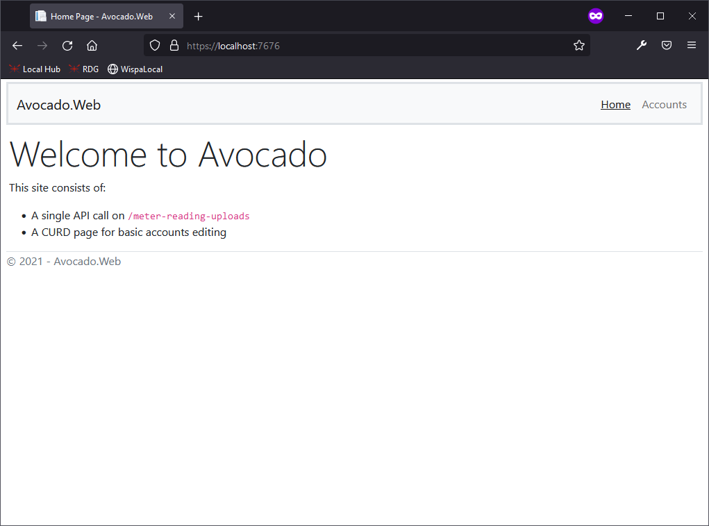
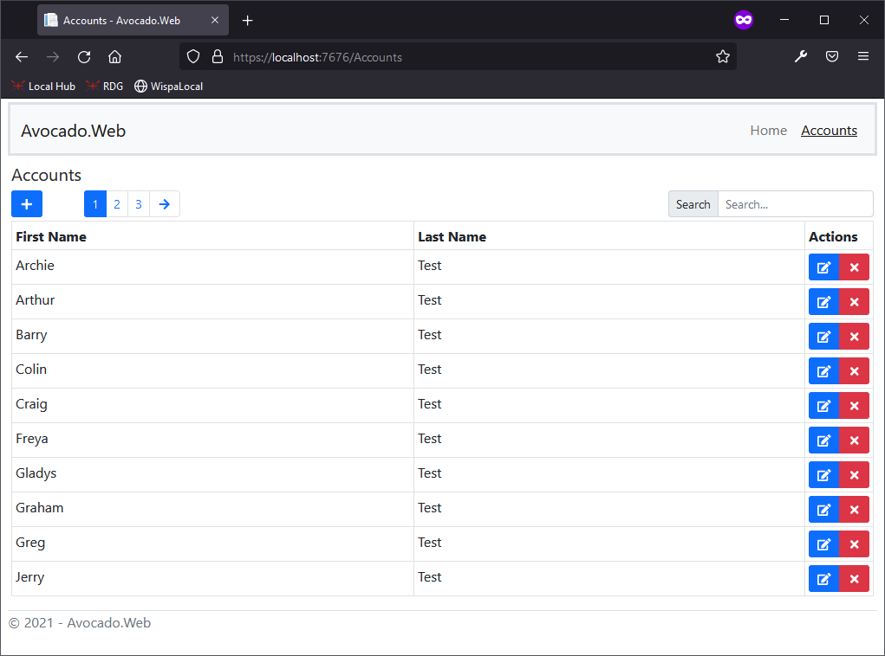
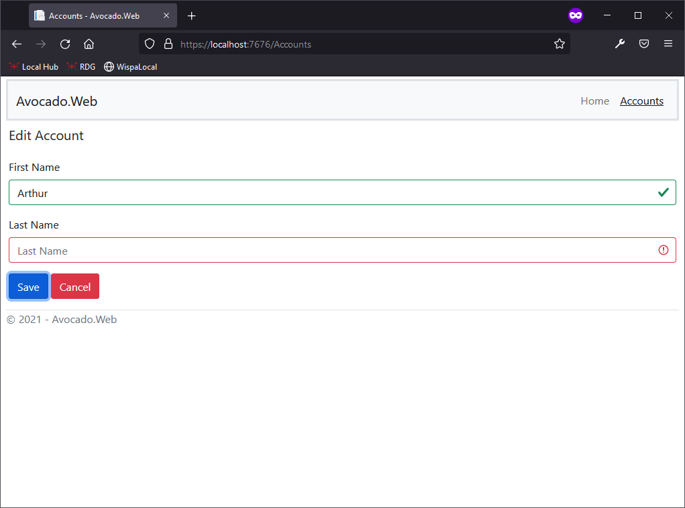

# Avocado 🤵
Avocado Meter Reading API

[](https://github.com/jonny64bit/Avocado/actions/workflows/test.yml)

### Response from test file

🤙: `POST => /meter-reading-uploads`

```JSON
{
    "result": "PARTIAL-SUCCESS",
    "detail": {
        "processed": 22,
        "total": 35,
        "errors": [
            "Rejecting duplicate. 2344,22/04/2019 09:24,01002",
            "Rejecting duplicate. 2344,22/04/2019 12:25,01002",
            "Unable to parse meter reading value. 2346,22/04/2019 12:25,999999",
            "Unable to parse meter reading value. 2349,22/04/2019 12:25,VOID",
            "Unrecognized account Id. 2354,22/04/2019 12:25,00889",
            "Unable to parse meter reading value. 2344,08/05/2019 09:24,0X765",
            "Unable to parse meter reading value. 6776,09/05/2019 09:24,-06575",
            "Unable to parse meter reading value. 4534,11/05/2019 09:24,",
            "Unable to parse meter reading value. 1235,13/05/2019 09:24,",
            "Unrecognized account Id. 1236,10/04/2019 19:34,08898",
            "Unrecognized account Id. 1237,15/05/2019 09:24,03455",
            "Unrecognized account Id. 1238,16/05/2019 09:24,00000",
            "Incorrect number of segments. 1241,11/04/2019 09:24,00436,X"
        ]
    }
}
```
The client used for these tests was Postman. An exported collection can be found in [Avocado.postman_collection](Postman/Avocado.postman_collection.json) it will need fixing up (URL & test file path) to work on someone elses machine.

### Development Setup 🛠

##### Requirements

-   Visual studio 2019
-   Node v14.6.0
-   Docker
-   SQL Server 2019

##### Steps

1. Open [Avocado.sln](Avocado.sln) file in Visual Studio
2. To setup a development database first adjust the constants at the top of [src/DatabaseQuickCreateAndMigrate/Program.cs](src/DatabaseQuickCreateAndMigrate/Program.cs) and run DatabaseQuickCreateAndMigrate console application. This will bootstrap a  development database with the correct seed data.
2. Install npm packages in [src/Avocado.Web/](src/Avocado.Web/)

```bash
npm install
```
3. Build front end

```bash
npm run build
```
4. Adjust docker network and desired ports in [docker-compose.yml](src/docker-compose.yml)
5. Adjust `DefaultConnection` to point at SQL Server [appsettings.json](src/Avocado.Web/appsettings.json). This is currently setup to find SQL Server 2019 running in a container with the hostname `sql` on the same network `online_dl`.
5. Build and run sln in Visual Studio using the docker compose project as the startup project
6. The application will run on `https://localhost` and your defined port setup

### Extra NPM Scripts ☕

Lint Typescript

```bash
npm run lint
```

### Pages 📃

#### Home



#### Accounts - CRUD

This lets you define the usual CRUD actions on an accounts with `Soft Delete`
It makes use of my open source Vue grid component [https://github.com/assureddt/pact-vue](https://github.com/assureddt/pact-vue)




### Notes ✏

- Missing security hardening or any authentication
- Only got default BS5 theme
- I generally wouldn't recommend passing CSV files around over APIs rather use JSON instead
- I would recommend rejecting the whole batch if any of the lines didn't validate.